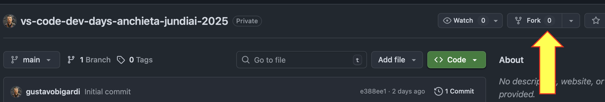

# VS Code Dev Days - 27/09/2025 - UniAnchieta Jundiaí

Conteúdos e atividades do VS Code Dev Days realizado no dia 27/09/2025 na UniAnchieta Jundiaí.

Acesse este conteúdo via QRCode e também apoiem nossas inciativas, deixando um star ⭐ no repositório do GitHub:

  

## Instrutores (links com direcionamento para o LinkedIn):
- Gustavo Bigardi - [LinkedIn](https://www.linkedin.com/in/gbbigardi/) :: [GitHub](https://github.com/gustavobigardi/)
- Elton Bordim - [LinkedIn](https://www.linkedin.com/in/elton-bordim/) :: [GitHub](https://github.com/ebordim)
- Laura de Alencar - [LinkedIn](https://www.linkedin.com/in/lauralencarr/)

## Referências utilizadas:
- [VS Code Dev Days - GitHub](https://github.com/microsoft/VS-Code-Dev-Days)
- [Download do VS Code](https://aka.ms/vscode-dev-days/get-vscode)
- [Obtenha o GitHub Copilot Free](https://aka.ms/vscode-dev-days/get-copilot)
- [Extensions for VS Code](https://marketplace.visualstudio.com/vscode)
- [Model Context Protocol](https://marketplace.visualstudio.com/vscode)
- [GitHub MCP Registry](https://github.com/mcp)
- [Awesome MCP Servers](https://mcpservers.org)
- [Microsoft Learn MCP Server overview](https://learn.microsoft.com/en-us/training/support/mcp)

## Atividades previstas

| #  | Topic                                              | Duration      | Description                                                                 | Resources                |
|----|----------------------------------------------------|--------------|-----------------------------------------------------------------------------|--------------------------|
| 01 | Técnicas Essenciais para uso do GitHub Copilot no VS Code | 30–45 minutes| Comece a utilizar o GitHub Copilot no VS Code.                                | [**Slides**](/slides/VSCode_GitHubCopilot%20-%20pt-BR.pdf)            |
| 02 | Community Session                                 | 30–45 minutes| Aprenda a dar ao GitHub Copilot mais ferramentas para expandir os recursos do seu fluxo de trabalho de desenvolvimento com MCP. | [**Slides**](/slides/VSCode_GitHubCopilot%20-%20MCP.pdf)  |
| 03 | Workshop                                          | 60 minutes   | Use o GitHub Copilot, via modo agentic, para trabalhar com C#.                             | [**Instruções**](https://github.com/DotNetSP/integrate-mcp-with-copilot) |

## Pré-requisitos

Caso ainda não tenha uma conta no GitHub, comece instalando um aplicativo de One-Time Password (OTP) em seu celular. Recomendamos o Microsoft Authenticator, com versões para Android e iOS: https://www.microsoft.com/pt-br/security/mobile-authenticator-app

Em seguida crie sua conta no GitHub usando um e-mail e nome válidos, com o link a seguir trazendo algumas instruções úteis e lembrando da necessidade se habilitar o MFA (autenticação multifator): https://docs.github.com/pt/get-started/start-your-journey/creating-an-account-on-github

Caso utilize uma máquina do laboratório, procure preferencialmente trabalhar com o GitHub logado em uma aba anônima!

## Para seguir aprendendo

|              Laboratório              |                       Tópicos ensinados                     |                     Objetivo de Aprendizagem                |
| :------------------------------------: | :---------------------------------------------------------: | ----------------------------------------------------------- |
| [Hands-on com o GitHub Copilot: Criando Planos de Estudo com IA utilizando Modelos do GitHub](https://github.com/microsoft/lab-study-app/tree/main/tutorial/translations/pt-br) | Use o GitHub Copilot e o GitHub Models para gerar planos de estudo personalizados em uma aplicação web baseada em Flask. | Crie e personalize uma ferramenta de planejamento de estudos com IA usando o GitHub Copilot e o GitHub Models. Configure uma aplicação Flask, desenvolva prompts eficazes para criar trilhas de aprendizado personalizadas e incorpore testes de acessibilidade utilizando modos de chat personalizados. |

## Preparando seu ambiente para testes

Faça um fork deste repositório em sua conta pessoal para futura referência e poder editar os conteúdo dele.

